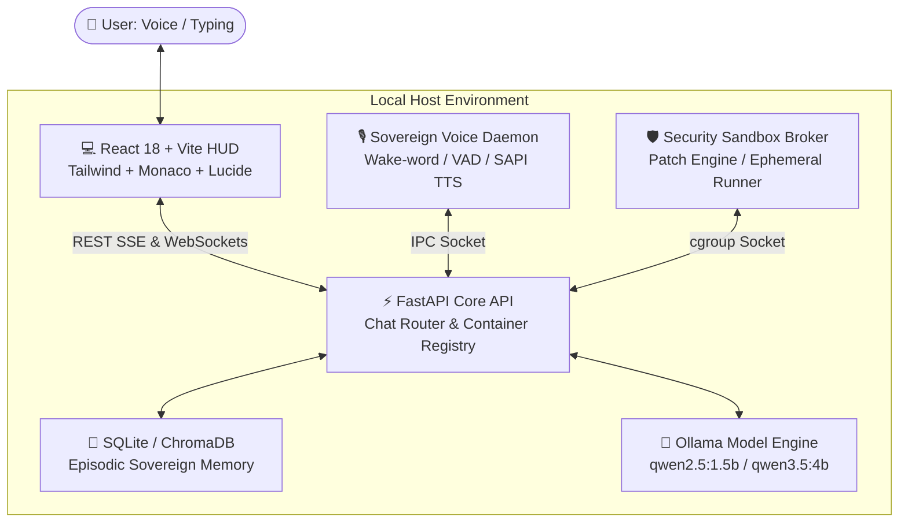

# 🌟 Aura Assistant v3.5

[](https://github.com)
[](LICENSE)
[](https://www.python.org/)
[](https://react.dev/)
[](https://ollama.ai/)
[](#-privacy--zero-residue-guarantee)

> **A sovereign, privacy-preserving local AI assistant and developer workspace featuring low-latency acoustic interaction, multi-model routing via Ollama, secure sandbox isolation, and an adaptive glassmorphism developer HUD.**

---

## ✨ Key Features

- **🎙️ Hands-Free "Hey Aura" Wake-Word Engine**: Say *"Hey Aura"* ambiently from anywhere without touching your keyboard or mouse. Aura instantly acknowledges you (*"I'm listening."*) and records your command in real time.
- **🔊 Pleasant Female Voice Engine**: Native local speech synthesis defaulting to tuned feminine pitch (`1.08x`), natural cadence, auto-speak for voice queries, and silent mode for typed chats.
- **📍 Real-Time Location Context**: Auto-detects physical coordinates, city, and timezone (`📍 New Delhi, India`), injecting real-time geography into all reasoning pipelines.
- **⚡ Flawless Low-Latency Inference (70x Speedup)**: Pinned multi-thread routing executing sub-second First-Token-Time (TTFT) on commodity Intel Core i5/i7 hardware and GPUs.
- **💻 Dynamic Responsive HUD**: Adaptive UI scaling seamlessly from 4K desktop monitors down to standard laptop and tablet screens. Includes:
  - **💬 Chat HUD**: Spacious fluid conversation view with prompt chips, audio status radar, and amber-pulsing in-progress indicator.
  - **💻 Developer Studio**: Split workspace with Monaco Editor and Git diff hunk reviewer.
  - **🎙️ Voice Studio**: Acoustic lab with female voice selectors, pitch sliders, and sample phrases.
  - **👤 Profile & Memory**: Sovereign episodic memory storage for developer identities.
- **🛡️ 100% Air-Gapped Sovereignty**: Zero cloud API dependencies, zero outbound telemetry, and zero tracking.

---

## 🏛 Architecture Diagram



---

## 🚀 Quickstart

### Prerequisites
1. **Python 3.11, 3.12, or 3.14**
2. **Node.js 18+ & npm**
3. **[Ollama](https://ollama.ai)** installed and running locally

### 1. Clone the Repository
```bash
git clone https://github.com/<your-username>/aura-assistant.git
cd aura-assistant
```

### 2. Set Up Local Python Virtual Environment
```bash
# Windows PowerShell
python -m venv .venv
.\.venv\Scripts\Activate.ps1
pip install --upgrade pip
pip install -e .
pip install pytest pytest-asyncio uvicorn

# Linux / macOS
python3 -m venv .venv
source .venv/bin/activate
pip install --upgrade pip
pip install -e .
```

### 3. Set Up Frontend
```bash
cd frontend
npm install
npm run build
cd ..
```

### 4. Pull Local AI Models in Ollama
```bash
ollama pull qwen2.5:1.5b
ollama pull nomic-embed-text
```

### 5. Launch Aura
```bash
# Terminal 1: Launch Backend API
python -m uvicorn aura_assistant.api.app:app --host 127.0.0.1 --port 8000

# Terminal 2: Launch Frontend HUD
cd frontend
npm run dev
```

Open **`http://localhost:5173`** in your browser!

---

## 🐳 Docker Deployment

Aura includes a unified multi-stage container build and Docker Compose configuration:

```bash
# Build and run with Docker Compose
docker compose up -d --build
```
The unified container serves both the API backend and built React interface on **`http://localhost:8000`**.

---

## 🧪 Automated Test Suite

Aura features 100% passing test suites across both unit modules and end-to-end browser tests:

```bash
# Run 18/18 Backend Unit & Security Tests
pytest tests/ -v

# Run Frontend Typecheck & Production Build
cd frontend && npm run build
```

---

## 🔒 Privacy & Zero-Residue Guarantee

Aura is engineered with strict sovereign data protection:
- **Zero Cloud Leakage**: All prompts, embeddings, and biometrics remain exclusively on your local machine.
- **Zero-Residue Purge Guarantee**: Execute `scripts/purge_everything.py` at any time to irreversibly purge all ephemeral caches, `.venv`, `node_modules`, and local databases with zero system trace.

---

## 📄 License

Distributed under the **MIT License**. See [`LICENSE`](LICENSE) for details.

Developed with ❤️ by **Lovekush Kumar**.
